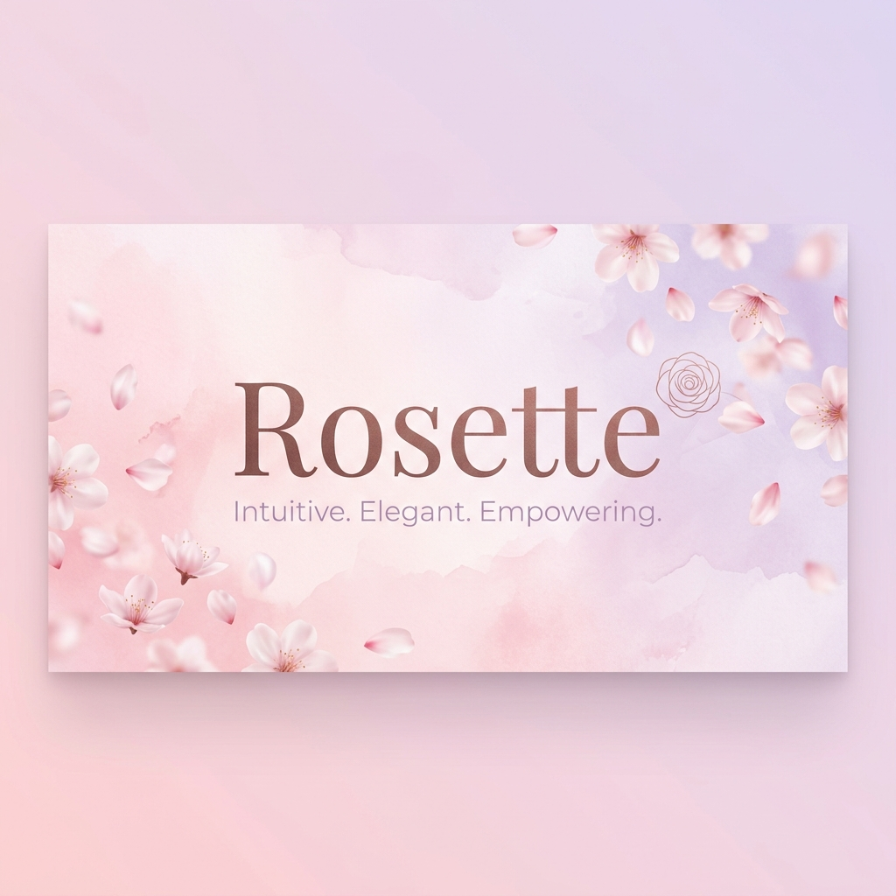

# 🌸 Rosette — Privacy-First MenstrualCycle Tracker

<div align="center">
  
  <p align="center">
    <strong>A minimalist, elegant, and privacy-focused period tracker for your daily life.</strong>
  </p>
  <p align="center">
    <a href="https://rosette-omega.vercel.app/"><strong>Live Demo »</strong></a>
    <br />
    <br />
    
    
    
    
    
  </p>
</div>

---

## ✨ Overview

**Rosette** is designed for those who value simplicity and privacy. Unlike mainstream period trackers that often collect and sell sensitive health data, Rosette keeps everything **on your device**. No accounts, no cloud sync (unless you choose to), and no tracking.

It’s built with a **Mobile-First** approach and a "Designer Studio" aesthetic — soft tones, elegant typography, and smooth micro-interactions that make tracking your health feel like a moment of self-care.

## 🚀 Key Features

- **🌸 Seamless Tracking**: Log your cycle start and end dates with a single tap.
- **📅 Visual Calendar**: View your past cycles and future predictions in a beautiful, intuitive calendar.
- **🔮 Smart Predictions**: Automatically calculates your next cycle based on your personal history.
- **🔕 Discreet Reminders**: Get gentle push notifications that are privacy-friendly (no one peaking at your screen will know what they're for).
- **🛡️ Privacy First**: Your health data is your business. Rosette stores data locally and uses Firebase only for secure push notifications.
- **📱 Mobile-First**: Optimized for a seamless experience on smartphones, perfect for on-the-go tracking.
- **✨ Premium UI**: A modern, responsive design built with Tailwind CSS 4 and glassmorphism elements.

## 🛠️ Tech Stack

- **Framework**: [React 19](https://react.dev/)
- **Build Tool**: [Vite 7](https://vitejs.dev/)
- **Styling**: [Tailwind CSS 4](https://tailwindcss.com/) (using the new Vite plugin)
- **Icons**: [Lucide React](https://lucide.dev/)
- **Backend/Notifications**: [Firebase](https://firebase.google.com/)
- **Date Management**: [date-fns](https://date-fns.org/)
- **Routing**: [React Router 7](https://reactrouter.com/)

## 📦 Getting Started

To run Rosette locally, follow these steps:

### Prerequisites
- Node.js (v18 or higher)
- npm or yarn

### Installation

1. **Clone the repository:**
   ```bash
   git clone https://github.com/krina2005/Rosette.git
   cd Rosette
   ```

2. **Install dependencies:**
   ```bash
   npm install
   ```

3. **Set up Firebase (Optional for local notifications):**
   - Create a project in the [Firebase Console](https://console.firebase.google.com/).
   - Add a Web App and copy the configuration.
   - Replace the config in `src/firebase.ts`.

4. **Start the development server:**
   ```bash
   npm run dev
   ```

5. **Build for production:**
   ```bash
   npm run build
   ```

## 🎨 Design Philosophy

Rosette follows a **Soft-Minimalist** approach. We use:
- **Typography**: Clean, readable sans-serif fonts.
- **Colors**: A palette of soft pinks, lilacs, and warm whites to evoke a sense of calm.
- **Mobile-First**: Designed primarily for mobile devices to ensure the best possible experience where it matters most.
- **Interactions**: Subtle scale effects and smooth transitions to make the app feel alive.

## 📄 License

This project is licensed under the MIT License - see the [LICENSE](LICENSE) file for details.

---

<p align="center">
  Made with ❤️ by <a href="https://github.com/krina2005">Krina Parmar</a>
</p>
